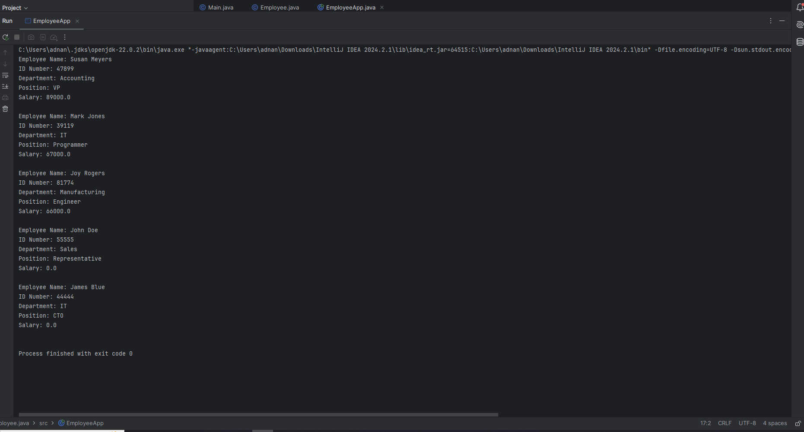

# Lab 1 – Employee Class

An object-oriented Java program built around an `Employee` model.

## Concepts

- encapsulation
- overloaded constructors
- getters and setters
- setter-based salary validation
- object creation
- overridden `toString()`

The salary setter accepts values from `$0` through `$90,000`; invalid values are stored as `0.0`.

## Run

```bash
javac -d out src/*.java
java -cp out EmployeeApp
```


